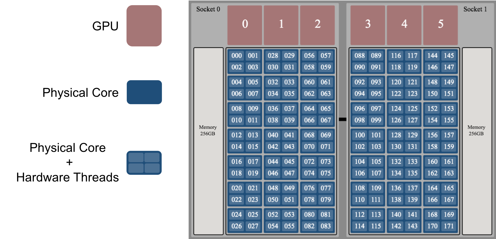
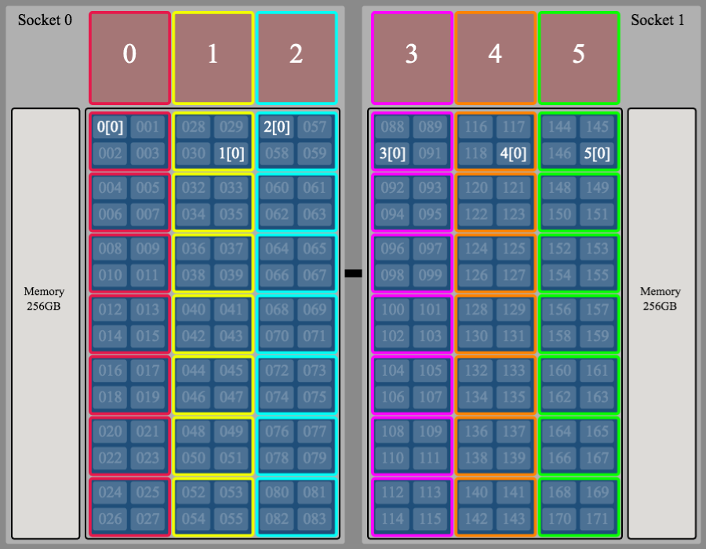
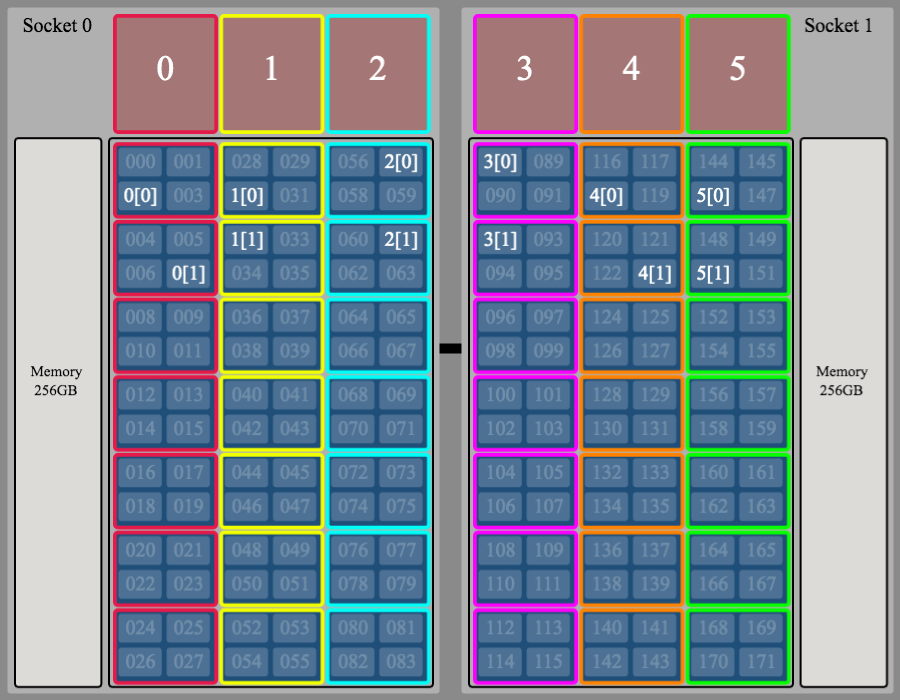
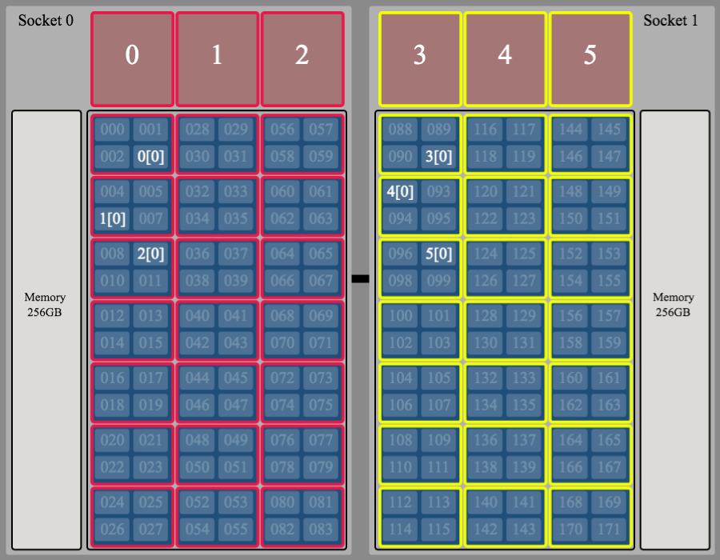

---

# `jsrun` Quick Start Guide

This tutorial is intended to give a basic overview of the `jsrun` job launcher. It is **not** intended to cover all aspects of `jsrun`. For a more complete overview, please see the [Summit User Guide - Job Launcher (jsrun)](https://www.olcf.ornl.gov/for-users/system-user-guides/summit/summit-user-guide/#job-launcher-(jsrun)). 

---

## Resource Sets

Resource sets are a central theme when discussing `jsrun`, so we should begin by defining them. 

* A <u>resource set</u> is a collection of resources (e.g., CPU cores, GPUs) that can be assigned to one or more tasks. 
* All resource sets are the same for a single `jsrun`
* A resource set cannot span more than 1 node.

This idea will become clearer as we continue below.
 
## `jsrun` Format

A `jsrun` command must contain the number of resource sets, a definition of the resource sets, and the program to be launched (along with its arguments). The basic format is as follows:

```c
jsrun [ # of resource sets ] [ definition of resource sets ] program [ program args ]
```

### Constructing a `jsrun` Command

The first step to contructing a `jsrun` command is to define the resource sets you want to use. The next step is to decide how many resource sets you want to use. This can be accomplished with the following set of flags:

<br>

| flag (long)      | flag (short) | description                               |
|----------------- | ------------ | ------------------------------------------|
| `--nrs`          | `-n`         | Number of resource sets                   | 
| `--cpu_per_rs`   | `-c`         | Number of physical cores per resource set | 
| `--gpu_per_rs`   | `-g`         | Number of GPUs per resource set           | 
| `--tasks_per_rs` | `-a`         | Number of tasks per resource set          |

<br>
There are a couple other flags we'll cover as well, but for now, let's just move forward with these.

## Summit Node

Before running an example code, it is instructive to look at a diagram of a Summit Node to understand the terminology that we'll use. 

Each Summit node contains 2 IBM Power9 CPUs and 6 NVIDIA V100 GPUs (1 CPU and 3 GPUs per socket). Each of the Power9 CPUs have 21 physical cores - each with 4 hardware threads. So, looking at the image below, physical core 0 contains hardware threads 000-003, physical core 1 contains hardware threads 004-007, etc. The numbering of hardware threads will be important as we proceed.

<br>
<center>

</center>
<br>

## Hello_jsrun

To demonstrate the use of `jsrun`, we will use a simple "Hello, World!" type program that prints out information about the resources being used in a job. To follow along, you can clone the [Hello_jsrun](https://code.ornl.gov/t4p/Hello_jsrun) repository: 

```c
$ git clone https://code.ornl.gov/t4p/Hello_jsrun.git
```

After cloning, move into the directory, load the cuda module, and compile with `make`:

```c
$ cd Hello_jsrun
$ module load cuda
$ make
``` 

Now grab a single compute node in an interactive job (you'll need to use a project ID you are associated with):

```c
$ bsub -P STF007 -nnodes 1 -W 20 -alloc_flags gpumps -Is /bin/bash
```

**<font color="red">NOTE:</font>** `-alloc_flags gpumps` enables the Multi-Process Service, which allows multiple MPI ranks to access the same GPU simultaneously. Because the GPUs on Summit's compute nodes are in exclusive mode by default, this program might crash or hang if this is not enabled.

Ok. Now that we have our compute node, we can test some `jsrun` resource layouts. 

## Example 1

As a first example, let's try to create the layout shown in the image below. Here, we are essentially splitting up the resources on our node among 6 resource sets, where each resource set is shown in a different color and in the M[T] numbering scheme, M represents the MPI rank ID and T represents the OpenMP thread ID. So, for example, 2[0] represents MPI rank 2 - OpenMP thread 0. Based on the image, this means that each resource set contains 1 MPI rank and a single OpenMP thread. 

<br>
<center>

</center>
<br>

Now let's try to create the `jsrun` command that will give us this layout. The first thing we need to do is define our resource sets. As shown in the image, each resource set will contain 7 physical cores (`-c7`), 1 GPU (`-g1`), and 1 MPI rank (`-a1`). To set the number of OpenMP threads, we will simply use the `OMP_NUM_THREADS` environment variable. Now that we have defined our resource sets, we can use `-n6` to create 6 of them.


```c
# Set the number of OpenMP threads to 1
$ export OMP_NUM_THREADS=1
```

```c
$ jsrun -n6 -c7 -g1 -a1 ./hello_jsrun | sort

---------- MPI Ranks: 6, OpenMP Threads: 1, GPUs per Resource Set: 1 ----------
MPI Rank 000, OMP_thread 00 on HWThread 001 of Node h49n16 - RT_GPU_id 0 : GPU_id 0 
MPI Rank 001, OMP_thread 00 on HWThread 029 of Node h49n16 - RT_GPU_id 0 : GPU_id 1 
MPI Rank 002, OMP_thread 00 on HWThread 058 of Node h49n16 - RT_GPU_id 0 : GPU_id 2 
MPI Rank 003, OMP_thread 00 on HWThread 089 of Node h49n16 - RT_GPU_id 0 : GPU_id 3 
MPI Rank 004, OMP_thread 00 on HWThread 117 of Node h49n16 - RT_GPU_id 0 : GPU_id 4 
MPI Rank 005, OMP_thread 00 on HWThread 145 of Node h49n16 - RT_GPU_id 0 : GPU_id 5
```

**<font color="red">NOTE:</font>** You should pipe the results into `sort` for easier reading.

As you can see from the output, the program prints the MPI rank ID and the OpenMP thread ID as well as the hardware thread each rank/thread ran on, the GPU(s) each rank/thread had available to it, and the hostname of the compute node. So, for example, MPI rank 0 (and its OpenMP thread 0) ran on hardware thread 001 with GPU 0 available to it, and the hostname of the compute node was h49n16. This corresponds to the "red" resource set shown in the image above. Looking at the rest of the output shows that we have successfully produced the results shown in the image.

**ADDITIONAL DETAILS:** 

* The actual hardware thread (within a physical core) that an MPI rank runs on will vary from run to run.
* In the output, `GPU_id` represents the node-level GPU ID (numbered 0-5) as shown in the image. 
* In the output, `RT_GPU_id` represents the GPU ID as seen from the CUDA runtime. Basically, each resource set numbers its GPUs starting from 0, which is why `RT_GPU_id` is 0 for all rows above.

## Example 2

For the next example, let's run the same program but use 2 OpenMP threads to create the layout shown in the image below. Although this example is very similar to the first one, it will help point out a subtlety that might otherwise be overlooked.

<br>
<center>

</center>
<br>

To create this layout, we will first try to simply change the number of OpenMP threads to 2 and rerun the same command we used in Example 1:

```c
# Set the number of OpenMP threads to 2
$ export OMP_NUM_THREADS=2
```
```c
$ jsrun -n6 -c7 -g1 -a1 ./hello_jsrun | sort

---------- MPI Ranks: 6, OpenMP Threads: 2, GPUs per Resource Set: 1 ----------
MPI Rank 000, OMP_thread 00 on HWThread 001 of Node h49n16 - RT_GPU_id 0 : GPU_id 0 
MPI Rank 000, OMP_thread 01 on HWThread 002 of Node h49n16 - RT_GPU_id 0 : GPU_id 0 
MPI Rank 001, OMP_thread 00 on HWThread 029 of Node h49n16 - RT_GPU_id 0 : GPU_id 1 
MPI Rank 001, OMP_thread 01 on HWThread 030 of Node h49n16 - RT_GPU_id 0 : GPU_id 1 
MPI Rank 002, OMP_thread 00 on HWThread 057 of Node h49n16 - RT_GPU_id 0 : GPU_id 2 
MPI Rank 002, OMP_thread 01 on HWThread 056 of Node h49n16 - RT_GPU_id 0 : GPU_id 2 
MPI Rank 003, OMP_thread 00 on HWThread 088 of Node h49n16 - RT_GPU_id 0 : GPU_id 3 
MPI Rank 003, OMP_thread 01 on HWThread 091 of Node h49n16 - RT_GPU_id 0 : GPU_id 3 
MPI Rank 004, OMP_thread 00 on HWThread 117 of Node h49n16 - RT_GPU_id 0 : GPU_id 4 
MPI Rank 004, OMP_thread 01 on HWThread 119 of Node h49n16 - RT_GPU_id 0 : GPU_id 4 
MPI Rank 005, OMP_thread 00 on HWThread 145 of Node h49n16 - RT_GPU_id 0 : GPU_id 5 
MPI Rank 005, OMP_thread 01 on HWThread 146 of Node h49n16 - RT_GPU_id 0 : GPU_id 5 
```

From the output, we can see that each MPI rank now has 2 OpenMP threads as intended. However, both OpenMP threads are running on the same physical core instead of on separate physical cores as shown in our image above. For example, OpenMP threads 0 and 1 of MPI rank 0, ran on hardware threads 001 and 002, which are both on the same physical core. So why did this happen? Each resource set has 7 physical cores available to it, so how do we use them? This brings us to a new flag:

<br>

| flag (long) | flag (short) | description                                                          |
|------------ | ------------ | ---------------------------------------------------------------------|
| `--bind`    | `-b`         | Binding of tasks within a resource set. Can be none, rs, or packed:#.|  

<br>
`--bind` allows you to set the number of physical cores available to an MPI task (to do things like spawn OpenMP threads on). By default, it is set to `-bpacked:1`, which means each MPI rank only has 1 physical core available to it. So when we spawned our 2 OpenMP threads from each MPI rank, they only had 1 physical core to run on (although 4 hardware threads). In some cases, this is undesired behavior that can slow down application performance.

If we want to run each OpenMP thread on its own physical core, we would need to set the `#` in `-bpacked:#` to the number of OpenMP threads we desire. So for our example, we would want `-bpacked:2`. Let's try that:

```c
$ jsrun -n6 -c7 -g1 -a1 -bpacked:2 ./hello_jsrun | sort

---------- MPI Ranks: 6, OpenMP Threads: 2, GPUs per Resource Set: 1 ----------
MPI Rank 000, OMP_thread 00 on HWThread 001 of Node h49n16 - RT_GPU_id 0 : GPU_id 0 
MPI Rank 000, OMP_thread 01 on HWThread 004 of Node h49n16 - RT_GPU_id 0 : GPU_id 0 
MPI Rank 001, OMP_thread 00 on HWThread 029 of Node h49n16 - RT_GPU_id 0 : GPU_id 1 
MPI Rank 001, OMP_thread 01 on HWThread 032 of Node h49n16 - RT_GPU_id 0 : GPU_id 1 
MPI Rank 002, OMP_thread 00 on HWThread 057 of Node h49n16 - RT_GPU_id 0 : GPU_id 2 
MPI Rank 002, OMP_thread 01 on HWThread 060 of Node h49n16 - RT_GPU_id 0 : GPU_id 2 
MPI Rank 003, OMP_thread 00 on HWThread 088 of Node h49n16 - RT_GPU_id 0 : GPU_id 3 
MPI Rank 003, OMP_thread 01 on HWThread 092 of Node h49n16 - RT_GPU_id 0 : GPU_id 3 
MPI Rank 004, OMP_thread 00 on HWThread 117 of Node h49n16 - RT_GPU_id 0 : GPU_id 4 
MPI Rank 004, OMP_thread 01 on HWThread 120 of Node h49n16 - RT_GPU_id 0 : GPU_id 4 
MPI Rank 005, OMP_thread 00 on HWThread 145 of Node h49n16 - RT_GPU_id 0 : GPU_id 5 
MPI Rank 005, OMP_thread 01 on HWThread 148 of Node h49n16 - RT_GPU_id 0 : GPU_id 5
```

Success! Now, from the hardware thread IDs, we can see that each OpenMP thread ran on a different physical core as we intended.

## Example 3

For our next example, we will split the resources on our node among 2 resource sets, with 1 resource set per socket. The desired layout will look like the image below. Here, we can see that each resource set contains 21 physical cores (`-c21`), 3 GPUs (`-g3`), and 3 MPI ranks (`-a3`; each with 1 OpenMP thread).

<br>

<center>

</center>

<br>

Based on what we've learned so far, we might try the following commands to create this layout:

```c
# Set the number of OpenMP threads to 1
$ export OMP_NUM_THREADS=1
```
```c
$ jsrun -n2 -c21 -g3 -a3 -bpacked:1 ./hello_jsrun | sort

---------- MPI Ranks: 6, OpenMP Threads: 1, GPUs per Resource Set: 3 ----------
MPI Rank 000, OMP_thread 00 on HWThread 002 of Node h49n16 - RT_GPU_id 0 1 2 : GPU_id 0 1 2 
MPI Rank 001, OMP_thread 00 on HWThread 089 of Node h49n16 - RT_GPU_id 0 1 2 : GPU_id 3 4 5 
MPI Rank 002, OMP_thread 00 on HWThread 006 of Node h49n16 - RT_GPU_id 0 1 2 : GPU_id 0 1 2 
MPI Rank 003, OMP_thread 00 on HWThread 093 of Node h49n16 - RT_GPU_id 0 1 2 : GPU_id 3 4 5 
MPI Rank 004, OMP_thread 00 on HWThread 010 of Node h49n16 - RT_GPU_id 0 1 2 : GPU_id 0 1 2 
MPI Rank 005, OMP_thread 00 on HWThread 097 of Node h49n16 - RT_GPU_id 0 1 2 : GPU_id 3 4 5
```

From the output, it appears we've created our 2 resource sets, but consecutive MPI ranks are jumping back and forth between resource sets (sockets in this case). For example, MPI rank 0 is on hardware thread 002 and has access to GPUs 0, 1, and 2 (i.e., socket 0), MPI rank 1 is on hardware thread 089 and has access to GPUs 3, 4, and 5 (i.e., socket 1), MPI rank 2 is on hardware thread 006 and has access to GPUs 0, 1, and 2 (i.e., socket 0), etc. This behavior can be changed with the `-d` flag:

<br>

| flag (long)             | flag (short) | description                                    |
|------------------------ | ------------ | -----------------------------------------------|
| `--launch_distribution` | `-d`         | How tasks are distributed among resource sets. Can be cyclic, packed, or plane:# |

<br>

* `-dcyclic` is used to assign MPI tasks to resource sets in a round-robin fashion. This is the default behavior, which is why we found the results above. 

* `-dpacked` is used to assign MPI tasks to resource sets such that the first resource set is filled, then the next, etc.

* `-dplane:#` can be thought of as a combination of `-dcylic` and `-dpacked`, where `#` represents the number of ranks to assign to the first resource set before moving on to fill the next resource set, etc.

<br>
For our example, we require `-dpacked`:

```c
$ jsrun -n2 -c21 -g3 -a3 -bpacked:1 -dpacked ./hello_jsrun | sort

---------- MPI Ranks: 6, OpenMP Threads: 1, GPUs per Resource Set: 3 ----------
MPI Rank 000, OMP_thread 00 on HWThread 000 of Node h49n16 - RT_GPU_id 0 1 2 : GPU_id 0 1 2 
MPI Rank 001, OMP_thread 00 on HWThread 006 of Node h49n16 - RT_GPU_id 0 1 2 : GPU_id 0 1 2 
MPI Rank 002, OMP_thread 00 on HWThread 010 of Node h49n16 - RT_GPU_id 0 1 2 : GPU_id 0 1 2 
MPI Rank 003, OMP_thread 00 on HWThread 089 of Node h49n16 - RT_GPU_id 0 1 2 : GPU_id 3 4 5 
MPI Rank 004, OMP_thread 00 on HWThread 094 of Node h49n16 - RT_GPU_id 0 1 2 : GPU_id 3 4 5 
MPI Rank 005, OMP_thread 00 on HWThread 097 of Node h49n16 - RT_GPU_id 0 1 2 : GPU_id 3 4 5
``` 

Success! Using this flag gives us the desired results. Now MPI ranks 0, 1, and 2 are on hardware threads 000, 006, and 010 and have access to GPUs 0, 1, and 2 (i.e., socket 0), while MPI ranks 3, 4, and 5 are on hardware threads 089, 094, and 097 and have access to GPUs 3, 4, and 5.

## Summary

While this is not intended to be a comprehensive tutorial on `jsrun`, hopefully it has given you a decent foundation to start using the job launcher. The `jsrun` flags we covered in this guide are summarized in the following table:

<br>

| flag (long)             | flag (short) | description                                    |
|------------------------ | ------------ | -----------------------------------------------|
| `--cpu_per_rs`          | `-c`         | Number of physical cores per resource set      | 
| `--gpu_per_rs`          | `-g`         | Number of GPUs per resource set                | 
| `--tasks_per_rs`        | `-a`         | Number of tasks per resource set               |
| `--nrs`                 | `-n`         | Number of resource sets                        | 
| `--rs_per_host`         | `-r`         | Number of resource sets per host (node)        | 
| `--bind`                | `-b`         | Binding of tasks within a resource set. Can be none, rs, or packed:#.|  
| `--launch_distribution` | `-d`         | How tasks are distributed among resource sets. Can be cyclic, packed, or plane:# |

<br>
**<font color="red">NOTE:</font>** We didn't actually cover the `--rs_per_host` flag because we only used a single node for our examples, but it is as straight-forward as the description implies.

These flags will give most users the ability to create the resource layouts they desire but, as mentioned above, this is only a sub-set of the functionality available with `jsrun`. If you would like more information about using `jsrun`, please see the following resources:

* [Summit User Guide - Job Launcher (jsrun)](https://www.olcf.ornl.gov/for-users/system-user-guides/summit/summit-user-guide/#job-launcher-(jsrun))
* The `jsrun` man page (on Summit)

### Available Tools

[Hello_jsrun](https://code.ornl.gov/t4p/Hello_jsrun) - A simple "Hello, World!" type program that can be used to test the layout of resources on Summit, Ascent, and SummitDev.

[jsrunVisualizer](https://jsrunvisualizer.olcf.ornl.gov/) - A web-based tool that mimics `jsrun` behavior locally in your browser. This is also the tool used to create the node images in this guide! 


